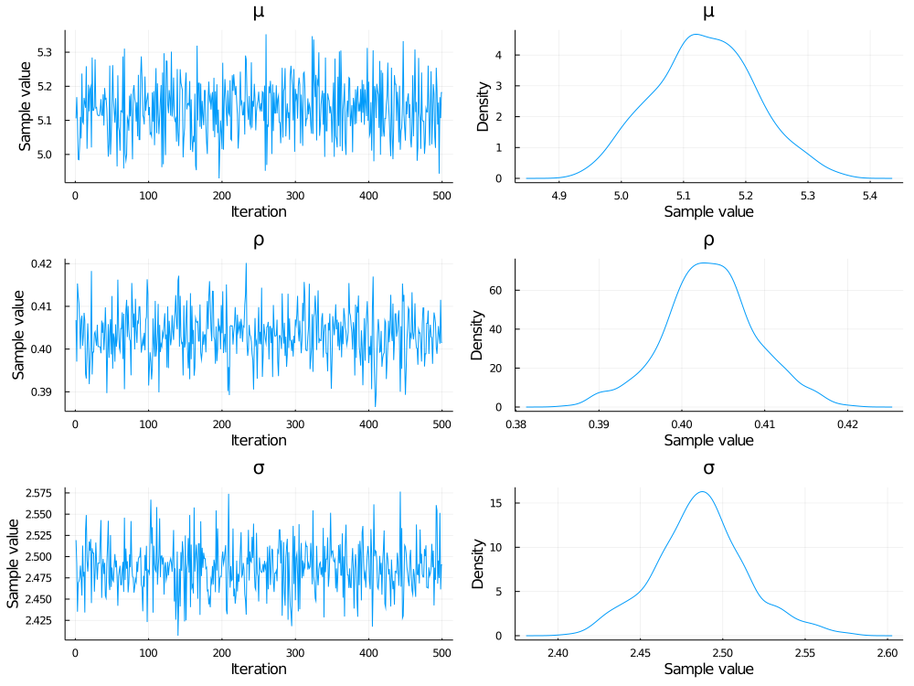

# GaussianMarkovRandomFields.jl
Lightweight sparse GMRF type, compatible with forward and reverse AD

This work-in-progress package provides an implementation of a Gaussian Markov random field--that is, a multivariate Gaussian distribution defined by a sparse precision matrix.  GMRFs are useful for modeling variables with spatial and/or temporal autocorrelation in an efficient way, since they can be defined in terms of a sparse precision matrix, rather than a dense covariance matrix.

The `GMRF` type defined here is a subtype of `Distributions.AbstractMvNormal`.  It is basically equivalent to an `MvNormalCanon` distribution from Distributions.jl, with the difference that it uses the pure-Julia LDLFactorizations.jl instead of CHOLMOD under the hood, so it works with ForwardDiff and ReverseDiff (though not Zygote at the moment).  It's performance is on par with the `MvNormalCanon` from Distributions. As the AD and Distributions ecosystems develop further this package may become irrelevant, but at the moment it's the only out-of-the-box way to include a GMRF in a Turing model (that I know of, anyway).

Issues, bugfixes, and contributions welcome!

## Example: fitting an autoregressive time-series model in Turing

```julia
using GaussianMarkovRandomFields
using Turing
using SparseArrays
using StatsPlots

'''Create an AR-1 precision matrix, given an autocorrelation coefficient `ρ` and series length `k`.'''
function ar_precision(ρ, k)
    return spdiagm(-1 => -ρ*ones(k-1), 0 => ones(k), 1 => -ρ*ones(k-1))
end

k = 5_000   # number of measurements in time series
σ = 2.5     # marginal variance
ρ = 0.4     # autocorrelation coefficient
μ = 5.0     # mean

Q = ar_precision(ρ, k) ./ σ^2
d = GMRF(μ*ones(k), Q)
x = rand(d)
plot(x)

@model function AR1(x)
    n = length(x)
    σ ~ Gamma(2, 3)
    ρ ~ Uniform(0, 0.5)
    μ ~ Normal(0, 10)
    Q = ar_precision(ρ, n) ./ σ^2
    x ~ GMRF(μ*ones(k), Q)
end

mod = AR1(x)
@time chn = sample(mod, NUTS(), 1000)
plot(chn)
```


After compiling, this model runs in ~16 seconds (single-threaded) on a laptop with an Intel Core i9-9980 2.4 GHz CPU.
